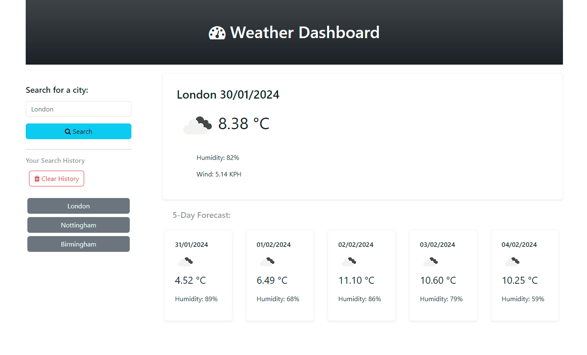

# Weather-Dashboard-JS-API
Module 8 Challenge Server-Side APIs: Weather Dashboard

## Description 

This Weather-Dashboard-JS-API was created for bootcamp students who were taking the eighth week's challenge. In this challenge, my task was to build a weather dashboard that will run in the browser and feature dynamically updated HTML and CSS.

The calendar application must meet the following critical requirements:

* Create a weather dashboard with form inputs.
  * When a user searches for a city they are presented with current and future conditions for that city and that city is added to the search history
  * When a user views the current weather conditions for that city they are presented with:
    * The city name
    * The date
    * An icon representation of weather conditions
    * The temperature
    * The humidity
    * The wind speed
  * When a user view future weather conditions for that city they are presented with a 5-day forecast that displays:
    * The date
    * An icon representation of weather conditions
    * The temperature
    * The humidity
  * When a user click on a city in the search history they are again presented with current and future conditions for that city

## Installation

N/A

## Usage 

To use Weather-Dashboard-JS-API,  you can review each file. 
To check whether the application meets critical requirements, open the webpage [Weather Dashboard](https://qingh2o.github.io/Weather-Dashboard-JS-API/). 

The application should look similar to the screenshot below. 


### Display key feature

* Display current weather conditions and 5-day forecast when the user types a valid city name.
```text
Automatically convert the first letter of user input 
to uppercase and the remaining letters to lowercase 
to match OpenWeatherMap API city names.
```


* Display an error message after the user enters empty spaces or an invalid city name.


* Display all the search history after the user refreshes or reloads the page.


* Display weather conditions after the user clicks on a city button.



* Empty the page after the user clicks the “Clear History” button.


### Inspect page using Chrome DevTools

Open Chrome DevTools by right-clicking the page and selecting "Inspect". An Elements panel should open either below or to the side of the webpage in the browser. Click the Applications tab and expand Local Storage in the Storage section to see saved cities displayed on the right.

* The "Inspect" page should look similar to the screenshot below.


* Errors appear in the console log: error 400 (Bad Request) when the user enters empty spaces; error 404 (Not Found) when the user enters an invalid city. The "Inspect" page should look similar to the screenshot below.


## Credits

N/A

## License

Please refer to the LICENSE in the repo.
